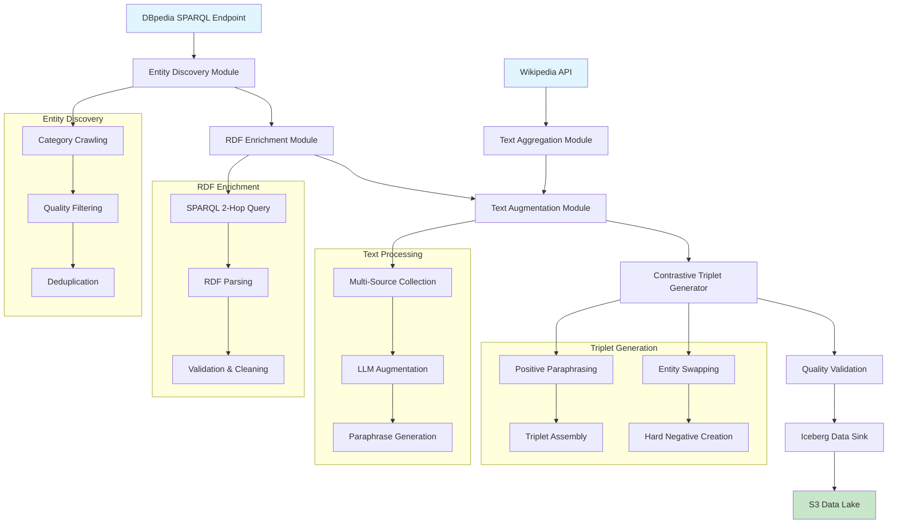
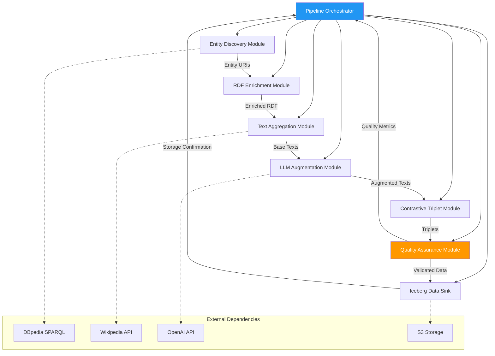
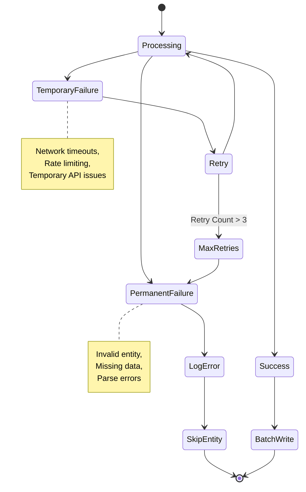
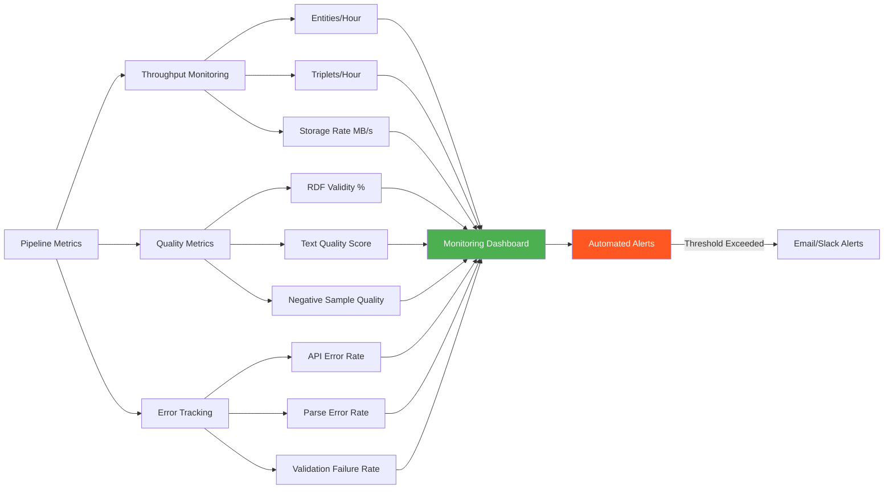
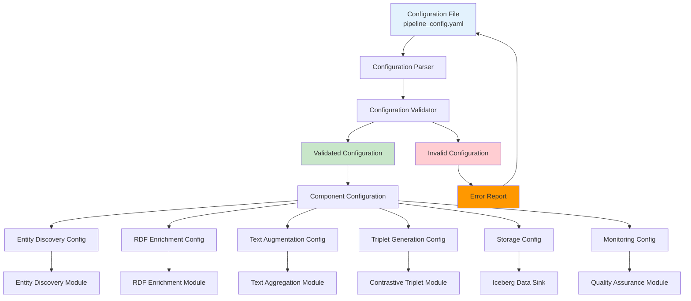
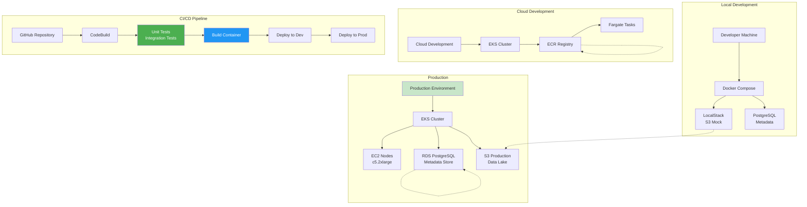

# **KG-CAE Data Generation Pipeline: Detailed Implementation Guide**

## **Overview**
This document provides comprehensive implementation details for the KG-CAE data generation pipeline described in Section 2.2 of the main research summary. The pipeline transforms raw DBpedia entities into structured training data suitable for contrastive learning and entity classification tasks.

## **Pipeline Architecture**



## **Data Flow and Processing Stages**

```mermaid
flowchart TD
    Start([Pipeline Start]) --> Config[Load Configuration]
    Config --> Discovery{Entity Discovery}

    Discovery --> |Category Seeds| Crawl[Category-Based Crawling]
    Crawl --> Filter[Quality Filtering]
    Filter --> Dedupe[Deduplication]
    Dedupe --> StoreEntities[Store Entity List]

    StoreEntities --> Enrichment{RDF Enrichment}
    Enrichment --> |For Each Entity| SparqlQuery[Execute SPARQL Query]
    SparqlQuery --> ParseRDF[Parse RDF Results]
    ParseRDF --> ValidateRDF{Valid RDF?}
    ValidateRDF --> |No| SkipEntity[Skip Entity]
    ValidateRDF --> |Yes| CleanRDF[Clean & Normalize]

    CleanRDF --> TextCollection{Text Collection}
    TextCollection --> WikiAPI[Wikipedia API Call]
    TextCollection --> DbpediaAbstract[DBpedia Abstracts]
    WikiAPI --> AggregateText[Aggregate Texts]
    DbpediaAbstract --> AggregateText

    AggregateText --> Augmentation{LLM Augmentation}
    Augmentation --> GenerateVariants[Generate Text Variants]
    GenerateVariants --> CombineTexts[Combine Base + Augmented]

    CombineTexts --> TripletGen{Triplet Generation}
    TripletGen --> |For Each Text| Paraphrase[Generate Paraphrase]
    TripletGen --> SwapEntities[Entity Swapping]
    Paraphrase --> AssembleTriplet[Assemble Triplet]
    SwapEntities --> AssembleTriplet

    AssembleTriplet --> QualityCheck{Quality Validation}
    QualityCheck --> |Pass| BatchBuffer[Add to Batch Buffer]
    QualityCheck --> |Fail| SkipTriplet[Skip Triplet]

    BatchBuffer --> |Batch Full| IcebergWrite[Write to Iceberg]
    IcebergWrite --> Metrics[Update Metrics]
    Metrics --> NextEntity{Next Entity?}

    NextEntity --> |Yes| Enrichment
    NextEntity --> |No| FinalWrite[Write Final Batch]
    FinalWrite --> Validation[Pipeline Validation]
    Validation --> Complete([Pipeline Complete])

    SkipEntity --> NextEntity
    SkipTriplet --> NextEntity

    style Start fill:#4caf50,color:#fff
    style Complete fill:#4caf50,color:#fff
    style QualityCheck fill:#ff9800
    style Validation fill:#2196f3
```



## **Module Interaction Diagram**



## **Error Handling and Recovery Flow**



## **Performance Monitoring Dashboard**



---

## **1. Entity Discovery Module (`entity_discovery.py`)**

## **1. Entity Discovery Module (`entity_discovery.py`)**

### **Core Configuration**
```python
class EntityDiscoveryConfig:
    SPARQL_ENDPOINT = "https://dbpedia.org/sparql"
    USER_AGENT = "KG-CAE-DataGen/1.0 (research@example.com)"
    MAX_RETRIES = 3
    TIMEOUT = 30
    BATCH_SIZE = 1000

    # Category seeds for different domains
    SEED_CATEGORIES = {
        "science": ["dbo:Scientist", "dbo:AcademicJournal", "dbo:ResearchProject"],
        "history": ["dbo:HistoricalEvent", "dbo:Monarch", "dbo:War"],
        "geography": ["dbo:Country", "dbo:City", "dbo:Mountain"],
        "arts": ["dbo:Artist", "dbo:Artwork", "dbo:MusicGenre"]
    }
```

### **Category-Based Crawling Algorithm**

```python
def discover_entities_by_category(category_uri: str, max_depth: int = 2) -> Set[str]:
    """
    Recursively discover entities within a DBpedia category hierarchy.

    Args:
        category_uri: DBpedia category URI (e.g., 'dbo:Scientist')
        max_depth: Maximum category hierarchy depth to traverse

    Returns:
        Set of discovered entity URIs
    """
    discovered_entities = set()
    visited_categories = set()

    def crawl_category(cat_uri: str, current_depth: int):
        if current_depth > max_depth or cat_uri in visited_categories:
            return

        visited_categories.add(cat_uri)

        # Query for direct entities in this category
        entity_query = f"""
        SELECT DISTINCT ?entity WHERE {{
            ?entity rdf:type <{cat_uri}> .
            ?entity dbo:abstract ?abstract .
            FILTER(LANG(?abstract) = "en")
            FILTER(STRLEN(?abstract) > 200)
        }} LIMIT 500
        """

        try:
            results = sparql_query(entity_query)
            batch_entities = {r['entity']['value'] for r in results['results']['bindings']}
            discovered_entities.update(batch_entities)

            # Recursively crawl subcategories if depth allows
            if current_depth < max_depth:
                subcategory_query = f"""
                SELECT DISTINCT ?subcat WHERE {{
                    ?subcat skos:broader <{cat_uri}> .
                }}
                """
                sub_results = sparql_query(subcategory_query)
                for subcat in sub_results['results']['bindings']:
                    crawl_category(subcat['subcat']['value'], current_depth + 1)

        except Exception as e:
            logger.warning(f"Failed to crawl category {cat_uri}: {e}")

    crawl_category(category_uri, 0)
    return discovered_entities
```

### **Quality Filtering and Deduplication**

```python
def filter_entity_quality(entity_uris: Set[str]) -> List[str]:
    """
    Apply quality filters to discovered entities.

    Filters:
    - Must have English Wikipedia page
    - Must have substantial DBpedia ontology properties
    - Must not be disambiguation pages
    """
    filtered_entities = []

    for uri in tqdm(entity_uris, desc="Quality filtering"):
        try:
            # Check Wikipedia page existence
            wiki_title = uri.split('/')[-1]
            wiki_response = requests.get(
                f"https://en.wikipedia.org/api/rest_v1/page/summary/{wiki_title}",
                timeout=10
            )

            if wiki_response.status_code != 200:
                continue

            # Check DBpedia property count
            property_query = f"""
            SELECT (COUNT(?p) as ?count) WHERE {{
                <{uri}> ?p ?o .
                FILTER(STRSTARTS(STR(?p), "http://dbpedia.org/ontology/"))
            }}
            """

            count_result = sparql_query(property_query)
            property_count = int(count_result['results']['bindings'][0]['count']['value'])

            if property_count >= 5:  # Minimum ontology properties
                filtered_entities.append(uri)

        except Exception as e:
            logger.debug(f"Quality check failed for {uri}: {e}")
            continue

    return filtered_entities
```

## **2. RDF Enrichment Module (`rdf_enrichment.py`)**

### **2-Hop Traversal Implementation**

```python
class RDFEnricher:
    def __init__(self, config: EntityDiscoveryConfig):
        self.config = config
        self.sparql = SPARQLWrapper(config.SPARQL_ENDPOINT,
                                   agent=config.USER_AGENT)
        self.sparql.setTimeout(config.TIMEOUT)
        self.sparql.setReturnFormat(JSON)

    def enrich_entity_rdf(self, entity_uri: str) -> Optional[Dict]:
        """
        Perform 2-hop RDF traversal for entity enrichment.

        Returns enriched RDF data with:
        - Direct entity properties (1-hop)
        - Related entity properties (2-hop)
        - Ontology type information
        """
        try:
            # 2-hop traversal query
            enrichment_query = f"""
            CONSTRUCT {{
                <{entity_uri}> ?p1 ?o1 .
                ?o1 ?p2 ?o2 .
                ?o1 rdf:type ?type .
            }} WHERE {{
                <{entity_uri}> ?p1 ?o1 .
                FILTER(STRSTARTS(STR(?p1), "http://dbpedia.org/ontology/"))

                # Optional 2-hop traversal
                OPTIONAL {{
                    ?o1 ?p2 ?o2 .
                    FILTER(STRSTARTS(STR(?p2), "http://dbpedia.org/ontology/"))
                    FILTER(ISURI(?o1))
                    FILTER(STRLEN(STR(?o2)) < 500)  # Limit literal length
                }}

                # Get ontology types for related entities
                OPTIONAL {{
                    ?o1 rdf:type ?type .
                    FILTER(STRSTARTS(STR(?type), "http://dbpedia.org/ontology/"))
                }}
            }}
            """

            self.sparql.setQuery(enrichment_query)
            self.sparql.setReturnFormat('turtle')

            rdf_result = self.sparql.query().convert().decode('utf-8')

            if not rdf_result.strip():
                return None

            return {
                'entity_uri': entity_uri,
                'rdf_turtle': rdf_result,
                'enrichment_timestamp': datetime.now().isoformat(),
                'hop_count': 2
            }

        except Exception as e:
            logger.error(f"RDF enrichment failed for {entity_uri}: {e}")
            return None
```

### **RDF Validation and Cleaning**

```python
def validate_rdf_content(rdf_turtle: str) -> bool:
    """
    Validate RDF content for training suitability.

    Checks:
    - Valid Turtle syntax
    - Contains ontology properties
    - Has reasonable size limits
    - No malformed URIs
    """
    try:
        # Parse RDF to check syntax
        g = rdflib.Graph()
        g.parse(data=rdf_turtle, format='turtle')

        # Check for ontology properties
        ontology_triples = 0
        for s, p, o in g:
            if 'dbpedia.org/ontology' in str(p):
                ontology_triples += 1

        return ontology_triples >= 3  # Minimum ontology coverage

    except Exception as e:
        logger.debug(f"RDF validation failed: {e}")
        return False

def clean_rdf_content(rdf_turtle: str) -> str:
    """
    Clean and normalize RDF content.

    Operations:
    - Remove duplicate triples
    - Normalize URI formats
    - Filter out non-ontology properties
    - Limit string literal lengths
    """
    g = rdflib.Graph()
    g.parse(data=rdf_turtle, format='turtle')

    # Create cleaned graph
    cleaned_g = rdflib.Graph()

    for s, p, o in g:
        # Keep only ontology properties
        if 'dbpedia.org/ontology' in str(p):
            # Limit string literal lengths
            if isinstance(o, rdflib.Literal) and len(str(o)) > 200:
                continue
            cleaned_g.add((s, p, o))

    return cleaned_g.serialize(format='turtle')
```

## **3. Text Augmentation Module (`text_augmentation.py`)**

### **Multi-Source Text Collection**

```python
class TextAggregator:
    def __init__(self, config):
        self.config = config
        self.wikipedia_api = wikipediaapi.Wikipedia(
            language='en',
            user_agent=config.USER_AGENT
        )

    def collect_entity_texts(self, entity_uri: str) -> Dict[str, List[str]]:
        """
        Collect text from multiple sources for an entity.

        Sources:
        - DBpedia abstracts (multiple languages)
        - Wikipedia page content
        - Wikidata descriptions
        """
        texts = {'en': [], 'multilingual': []}

        try:
            # DBpedia abstracts
            abstract_query = f"""
            SELECT ?abstract (LANG(?abstract) as ?lang) WHERE {{
                <{entity_uri}> dbo:abstract ?abstract .
                FILTER(STRLEN(?abstract) > 100)
            }}
            """

            results = sparql_query(abstract_query)
            for result in results['results']['bindings']:
                lang = result['lang']['value']
                abstract = result['abstract']['value']

                if lang == 'en':
                    texts['en'].append(abstract)
                else:
                    texts['multilingual'].append({
                        'text': abstract,
                        'language': lang
                    })

            # Wikipedia page content
            wiki_title = entity_uri.split('/')[-1].replace('_', ' ')
            wiki_page = self.wikipedia_api.page(wiki_title)

            if wiki_page.exists():
                # Extract first meaningful paragraph
                content = wiki_page.text
                paragraphs = [p.strip() for p in content.split('\n\n') if len(p.strip()) > 100]

                if paragraphs:
                    texts['en'].append(paragraphs[0][:1000])  # Limit length

        except Exception as e:
            logger.warning(f"Text collection failed for {entity_uri}: {e}")

        return texts
```

### **LLM-Based Text Augmentation**

```python
class LLMAugmenter:
    def __init__(self, model_name: str = "gpt-3.5-turbo"):
        self.client = OpenAI(api_key=os.getenv('OPENAI_API_KEY'))
        self.model = model_name

    def generate_augmented_texts(self, entity_name: str, base_text: str, num_variants: int = 3) -> List[str]:
        """
        Generate diverse text variants using LLM.

        Augmentation strategies:
        - Historical context
        - Simple explanations
        - Related concepts
        - Analogies
        """
        prompt_template = f"""
        Given the entity "{entity_name}" with description: "{base_text[:500]}..."

        Generate {num_variants} diverse text descriptions that capture different aspects:

        1. Historical/chronological context
        2. Simple explanation for beginners
        3. Connection to related concepts or fields
        4. Real-world impact or applications

        Each description should be 2-3 sentences and factually accurate.
        """

        try:
            response = self.client.chat.completions.create(
                model=self.model,
                messages=[{"role": "user", "content": prompt_template}],
                temperature=0.7,
                max_tokens=500
            )

            generated_text = response.choices[0].message.content

            # Parse and clean generated variants
            variants = []
            lines = generated_text.split('\n')

            for line in lines:
                line = line.strip()
                if line and len(line) > 50:
                    # Remove numbering
                    cleaned = re.sub(r'^\d+\.\s*', '', line)
                    variants.append(cleaned)

            return variants[:num_variants]

        except Exception as e:
            logger.error(f"LLM augmentation failed: {e}")
            return []
```

## **4. Contrastive Triplet Generation (`triplet_generator.py`)**

### **Entity Swapping for Hard Negatives**

```python
class NegativeSampleGenerator:
    def __init__(self, entity_index: Dict[str, List[str]]):
        """
        Args:
            entity_index: Mapping from ontology type to list of entity URIs
        """
        self.entity_index = entity_index
        self.sparql = SPARQLWrapper("https://dbpedia.org/sparql")

    def generate_hard_negative(self, anchor_rdf: str, anchor_text: str) -> Optional[Dict]:
        """
        Generate hard negative by swapping entities of same type.

        Process:
        1. Parse RDF to identify swappable entities
        2. Find replacement entities of same type
        3. Update both RDF and text
        """
        try:
            # Parse RDF
            g = rdflib.Graph()
            g.parse(data=anchor_rdf, format='turtle')

            # Find entities that can be swapped
            swappable_entities = []
            for s, p, o in g:
                if isinstance(o, rdflib.URIRef) and 'dbpedia.org/resource' in str(o):
                    # Get entity type
                    type_query = f"SELECT ?type WHERE {{ <{o}> rdf:type ?type . }}"
                    type_results = sparql_query(type_query)

                    if type_results['results']['bindings']:
                        entity_type = type_results['results']['bindings'][0]['type']['value']
                        swappable_entities.append({
                            'uri': str(o),
                            'type': entity_type,
                            'predicate': str(p)
                        })

            if not swappable_entities:
                return None

            # Try swapping each entity
            for entity_info in swappable_entities:
                replacement_uri = self.find_type_compatible_entity(entity_info['type'], entity_info['uri'])

                if replacement_uri:
                    # Update RDF
                    negative_rdf = anchor_rdf.replace(entity_info['uri'], replacement_uri)

                    # Update text (simple string replacement)
                    entity_label = entity_info['uri'].split('/')[-1].replace('_', ' ')
                    replacement_label = replacement_uri.split('/')[-1].replace('_', ' ')

                    negative_text = anchor_text.replace(entity_label, replacement_label)

                    # Verify the swap created a meaningful change
                    if negative_text != anchor_text and validate_rdf_content(negative_rdf):
                        return {
                            'text': negative_text,
                            'rdf': negative_rdf,
                            'swapped_entity': entity_info['uri'],
                            'replacement_entity': replacement_uri
                        }

            return None

        except Exception as e:
            logger.error(f"Negative sample generation failed: {e}")
            return None

    def find_type_compatible_entity(self, entity_type: str, exclude_uri: str) -> Optional[str]:
        """Find a different entity of the same type."""
        if entity_type not in self.entity_index:
            return None

        candidates = [uri for uri in self.entity_index[entity_type] if uri != exclude_uri]

        return random.choice(candidates) if candidates else None
```

### **Paraphrase Generation**

```python
class ParaphraseGenerator:
    def __init__(self, model_name: str = "t5-base"):
        self.tokenizer = T5Tokenizer.from_pretrained(model_name)
        self.model = T5ForConditionalGeneration.from_pretrained(model_name)

    def generate_paraphrase(self, text: str) -> str:
        """Generate paraphrased version of input text."""
        input_text = f"paraphrase: {text}"

        inputs = self.tokenizer(input_text, return_tensors="pt", max_length=512, truncation=True)

        outputs = self.model.generate(
            **inputs,
            max_length=200,
            num_beams=5,
            early_stopping=True,
            temperature=0.8
        )

        paraphrase = self.tokenizer.decode(outputs[0], skip_special_tokens=True)
        return paraphrase
```

## **5. Data Storage and Pipeline Orchestration**

### **Iceberg Table Management**

```python
class IcebergDataSink:
    def __init__(self, catalog_uri: str, table_name: str):
        self.catalog = load_catalog("default", **{"uri": catalog_uri})
        self.table_name = table_name
        self.schema = pa.schema([
            pa.field("anchor_text", pa.string()),
            pa.field("anchor_rdf", pa.string()),
            pa.field("positive_text", pa.string()),
            pa.field("negative_text", pa.string()),
            pa.field("negative_rdf", pa.string()),
            pa.field("subject_uri", pa.string()),
            pa.field("subject_uri_id", pa.int64()),
            pa.field("processing_timestamp", pa.timestamp('us')),
            pa.field("data_quality_score", pa.float64())
        ])

    def initialize_table(self):
        """Create Iceberg table if it doesn't exist."""
        if not self.catalog.table_exists(self.table_name):
            self.catalog.create_table(self.table_name, self.schema)

    def append_batch(self, batch_data: List[Dict]) -> bool:
        """Append batch of processed data to Iceberg table."""
        try:
            # Convert to Arrow table
            records = []
            for item in batch_data:
                record = {
                    'anchor_text': item['anchor_text'],
                    'anchor_rdf': item['anchor_rdf'],
                    'positive_text': item['positive_text'],
                    'negative_text': item['negative_text'],
                    'negative_rdf': item['negative_rdf'],
                    'subject_uri': item['subject_uri'],
                    'subject_uri_id': item['subject_uri_id'],
                    'processing_timestamp': pd.Timestamp.now(),
                    'data_quality_score': self.calculate_quality_score(item)
                }
                records.append(record)

            df = pd.DataFrame(records)
            arrow_table = pa.Table.from_pandas(df, schema=self.schema)

            table = self.catalog.load_table(self.table_name)
            table.append(arrow_table)

            return True

        except Exception as e:
            logger.error(f"Batch append failed: {e}")
            return False

    def calculate_quality_score(self, item: Dict) -> float:
        """Calculate data quality score for monitoring."""
        score = 0.0

        # RDF complexity
        rdf_triples = len(item['anchor_rdf'].split('\n'))
        score += min(rdf_triples / 10.0, 1.0) * 0.3

        # Text length appropriateness
        text_len = len(item['anchor_text'])
        if 100 <= text_len <= 1000:
            score += 0.3
        elif 50 <= text_len <= 1500:
            score += 0.2

        # Negative sample quality
        if item['negative_text'] != item['anchor_text']:
            score += 0.4

        return score
```

### **Pipeline Orchestration**

```python
class KGCAEPipeline:
    def __init__(self, config_path: str):
        self.config = self.load_config(config_path)
        self.entity_discovery = EntityDiscovery(self.config)
        self.rdf_enricher = RDFEnricher(self.config)
        self.text_aggregator = TextAggregator(self.config)
        self.llm_augmenter = LLMAugmenter()
        self.triplet_generator = TripletGenerator()
        self.data_sink = IcebergDataSink(
            self.config['iceberg_catalog_uri'],
            self.config['table_name']
        )

    def run_pipeline(self, categories: List[str], max_entities: int = 10000):
        """Execute complete data generation pipeline."""
        logger.info("Starting KG-CAE data generation pipeline")

        # Phase 1: Entity Discovery
        all_entities = set()
        for category in categories:
            entities = self.entity_discovery.discover_entities_by_category(category)
            all_entities.update(entities[:max_entities // len(categories)])

        # Phase 2: Data Processing
        processed_data = []
        for entity_uri in tqdm(list(all_entities), desc="Processing entities"):
            try:
                # RDF Enrichment
                rdf_data = self.rdf_enricher.enrich_entity_rdf(entity_uri)
                if not rdf_data:
                    continue

                # Text Collection
                texts = self.text_aggregator.collect_entity_texts(entity_uri)
                if not texts['en']:
                    continue

                # LLM Augmentation
                augmented_texts = self.llm_augmenter.generate_augmented_texts(
                    entity_uri.split('/')[-1],
                    texts['en'][0]
                )

                all_texts = texts['en'] + augmented_texts

                # Generate triplets for each text
                for text in all_texts:
                    triplet = self.triplet_generator.generate_triplet(
                        text, rdf_data['rdf_turtle'], entity_uri
                    )
                    if triplet:
                        processed_data.append(triplet)

                        # Batch write to Iceberg
                        if len(processed_data) >= self.config['batch_size']:
                            self.data_sink.append_batch(processed_data)
                            processed_data = []

            except Exception as e:
                logger.error(f"Failed to process {entity_uri}: {e}")
                continue

        # Final batch
        if processed_data:
            self.data_sink.append_batch(processed_data)

        logger.info("Pipeline execution completed")

    def validate_pipeline_output(self) -> Dict:
        """Validate pipeline output quality."""
        table = self.data_sink.catalog.load_table(self.data_sink.table_name)
        df = table.scan().to_pandas()

        validation_results = {
            'total_samples': len(df),
            'avg_text_length': df['anchor_text'].str.len().mean(),
            'rdf_complexity': df['anchor_rdf'].str.count('\n').mean(),
            'negative_quality': (df['negative_text'] != df['anchor_text']).mean(),
            'entity_coverage': df['subject_uri'].nunique()
        }

        return validation_results
```

## **Configuration and Deployment**

### **Pipeline Configuration Flow**



### **Deployment Architecture**



### **Pipeline Configuration (`pipeline_config.yaml`)**

```yaml
# KG-CAE Data Generation Pipeline Configuration

pipeline:
  name: "kg-cae-data-gen-v1"
  version: "1.0.0"
  batch_size: 1000
  max_workers: 4

data_sources:
  sparql_endpoint: "https://dbpedia.org/sparql"
  wikipedia_api: "https://en.wikipedia.org/api/rest_v1"
  user_agent: "KG-CAE-DataGen/1.0 (research@example.com)"

storage:
  iceberg_catalog_uri: "s3://your-bucket/iceberg/"
  table_name: "kgcae.training_data"
  s3_region: "us-east-1"

processing:
  entity_discovery:
    max_depth: 2
    quality_threshold: 0.8
    max_entities_per_category: 5000

  rdf_enrichment:
    hop_count: 2
    max_triple_count: 50
    ontology_only: true

  text_augmentation:
    llm_model: "gpt-3.5-turbo"
    max_variants: 3
    temperature: 0.7

  triplet_generation:
    negative_sample_strategy: "entity_swap"
    paraphrase_model: "t5-base"
    margin: 0.5

monitoring:
  enable_metrics: true
  log_level: "INFO"
  progress_tracking: true
```

### **Docker Deployment**

```dockerfile
FROM python:3.9-slim

# Install system dependencies
RUN apt-get update && apt-get install -y \
    build-essential \
    && rm -rf /var/lib/apt/lists/*

# Install Python dependencies
COPY requirements.txt .
RUN pip install --no-cache-dir -r requirements.txt

# Copy pipeline code
COPY . /app
WORKDIR /app

# Set environment variables
ENV PYTHONPATH=/app
ENV PYTHONUNBUFFERED=1

# Run pipeline
CMD ["python", "run_pipeline.py", "--config", "pipeline_config.yaml"]
```

## **Performance Optimization and Scaling**

### **Parallel Processing Strategies**

```python
from concurrent.futures import ThreadPoolExecutor, as_completed
from functools import partial

def process_entity_batch(entity_batch: List[str], pipeline_components) -> List[Dict]:
    """Process a batch of entities in parallel."""
    results = []

    def process_single_entity(entity_uri: str) -> Optional[Dict]:
        try:
            # Sequential processing per entity
            rdf_data = pipeline_components['enricher'].enrich_entity_rdf(entity_uri)
            texts = pipeline_components['aggregator'].collect_entity_texts(entity_uri)
            augmented = pipeline_components['llm'].generate_augmented_texts(entity_uri, texts['en'][0])
            triplet = pipeline_components['generator'].generate_triplet(texts['en'][0], rdf_data['rdf_turtle'], entity_uri)

            return triplet
        except Exception as e:
            logger.error(f"Entity processing failed: {e}")
            return None

    with ThreadPoolExecutor(max_workers=4) as executor:
        futures = [executor.submit(process_single_entity, uri) for uri in entity_batch]
        for future in as_completed(futures):
            result = future.result()
            if result:
                results.append(result)

    return results
```

### **Memory and I/O Optimization**

- **Streaming Processing**: Process entities in batches without loading all data into memory
- **Connection Pooling**: Reuse SPARQL connections and HTTP sessions
- **Caching**: Cache frequently accessed entity types and Wikipedia pages
- **Compression**: Use LZ4 compression for Iceberg table storage

## **Quality Assurance and Monitoring**

### **Automated Quality Checks**

```python
class DataQualityMonitor:
    def __init__(self, pipeline_config):
        self.config = pipeline_config
        self.metrics = {}

    def run_quality_checks(self, sample_data: List[Dict]) -> Dict[str, float]:
        """Run comprehensive quality checks on sample data."""

        checks = {
            'text_length_distribution': self.check_text_lengths(sample_data),
            'rdf_validity': self.check_rdf_validity(sample_data),
            'negative_sample_quality': self.check_negative_quality(sample_data),
            'entity_linking_consistency': self.check_entity_consistency(sample_data),
            'factual_accuracy': self.check_factual_accuracy(sample_data)
        }

        return checks

    def check_text_lengths(self, data: List[Dict]) -> float:
        """Check text length distribution."""
        lengths = [len(item['anchor_text']) for item in data]
        mean_length = np.mean(lengths)
        std_length = np.std(lengths)

        # Ideal range: 200-800 characters
        ideal_range = sum(1 for l in lengths if 200 <= l <= 800)
        return ideal_range / len(lengths)

    def check_rdf_validity(self, data: List[Dict]) -> float:
        """Check RDF syntactic validity."""
        valid_count = 0
        for item in data:
            try:
                rdflib.Graph().parse(data=item['anchor_rdf'], format='turtle')
                valid_count += 1
            except:
                continue
        return valid_count / len(data)

    def check_factual_accuracy(self, data: List[Dict]) -> float:
        """Spot-check factual accuracy against DBpedia."""
        # Sample 10% of data for manual verification
        sample = random.sample(data, min(50, len(data)))
        accurate_count = 0

        for item in sample:
            if self.verify_facts_against_dbpedia(item):
                accurate_count += 1

        return accurate_count / len(sample)
```

This detailed implementation guide provides the complete technical specification for the KG-CAE data generation pipeline, including code examples, configuration options, and quality assurance procedures.</content>
<parameter name="filePath">c:\Users\david\OneDrive\Documents\AIArch\matter_wave\Research\DataGenerationPipeline_Detailed.md