Excellent question! Thinking about this as a SKOS hierarchy is precisely the right way to model it for a knowledge organization system. It forces us to define the scope and structure clearly.

The choice of a root node depends entirely on the **scope and purpose of your knowledge organization system (your `skos:ConceptScheme`)**. There isn't one single "correct" answer, but rather several well-justified options.

Let's break down the most logical choices, from the broadest to the most specific.

### Option 1: The Most General Root (The "Academic Disciplines" Approach)

If your goal is to model *all* human knowledge as represented in academic disciplines, the root would be very high-level.

*   **Root Node (`skos:Concept`):** `Academic Disciplines` or `Fields of Study`
    *   **SKOS Structure:** This concept would be the `skos:topConceptOf` your `skos:ConceptScheme`.
*   **Top-Level Children (`skos:narrower`):**
    *   `Formal Sciences` (e.g., Logic, Mathematics, Computer Science)
    *   `Natural Sciences` (e.g., Physics, Chemistry, Biology)
    *   **`Social Sciences and Humanities`** (or you could keep them separate)

In this model, the node you're interested in, `Social Sciences and Humanities`, is not the root itself, but a primary branch. This is arguably the most accurate and extensible model for classifying all academic knowledge.

**SKOS Example (in Turtle syntax):**

```turtle
@prefix skos: <http://www.w3.org/2004/02/skos/core#> .
@prefix ex: <http://example.org/disciplines/> .

ex:MyScheme a skos:ConceptScheme;
    skos:hasTopConcept ex:AcademicDisciplines .

ex:AcademicDisciplines a skos:Concept;
    skos:prefLabel "Academic Disciplines"@en;
    skos:topConceptOf ex:MyScheme;
    skos:narrower ex:NaturalSciences, ex:SocialSciences, ex:Humanities, ex:FormalSciences .

ex:SocialSciences a skos:Concept;
    skos:prefLabel "Social Sciences"@en;
    skos:broader ex:AcademicDisciplines .

ex:Humanities a skos:Concept;
    skos:prefLabel "Humanities"@en;
    skos:broader ex:AcademicDisciplines .
```

---

### Option 2: The Practical, Domain-Specific Root

If your project is *only* about the Social Sciences and Humanities, then making a combined root node is the most practical approach.

*   **Root Node (`skos:Concept`):** `Social Sciences and Humanities`
    *   **SKOS Structure:** This concept is the single `skos:topConceptOf` a Concept Scheme dedicated to this domain.
*   **Top-Level Children (`skos:narrower`):**
    *   `Social Sciences`
    *   `Humanities`
*   **Further Down the Tree:**
    *   `Social Sciences` would have narrower concepts like `Sociology`, `Psychology`, `Economics`.
    *   `Humanities` would have narrower concepts like `Philosophy`, `Literature`, `Art History`.

This is the most common and useful approach if your application or dataset is focused specifically on this area. It's clean, simple, and directly addresses the domain.

**SKOS Example:**

```turtle
@prefix skos: <http://www.w3.org/2004/02/skos/core#> .
@prefix ex: <http://example.org/ssh_domain/> .

ex:SSH_Scheme a skos:ConceptScheme;
    skos:prefLabel "Social Sciences and Humanities Taxonomy"@en;
    skos:hasTopConcept ex:SocialSciencesAndHumanities .

ex:SocialSciencesAndHumanities a skos:Concept;
    skos:prefLabel "Social Sciences and Humanities"@en;
    skos:topConceptOf ex:SSH_Scheme;
    skos:narrower ex:SocialSciences, ex:Humanities .

ex:SocialSciences a skos:Concept;
    skos:prefLabel "Social Sciences"@en;
    skos:broader ex:SocialSciencesAndHumanities;
    skos:narrower ex:Sociology, ex:Economics . # and so on

ex:Humanities a skos:Concept;
    skos:prefLabel "Humanities"@en;
    skos:broader ex:SocialSciencesAndHumanities;
    skos:narrower ex:Philosophy, ex:Literature . # and so on
```

---

### Option 3: The Dual-Root Approach

SKOS allows for a `skos:ConceptScheme` to have multiple top concepts. This is useful when you have several parallel, equally important starting points.

*   **Root Nodes (Two `skos:topConceptOf`):**
    1.  `Social Sciences`
    2.  `Humanities`
*   **Rationale:** This model acknowledges that while often grouped together, Social Sciences and Humanities are fundamentally distinct domains with different methodologies. It avoids creating an artificial parent node ("Social Sciences and Humanities") and treats them as separate but related pillars of the same scheme. The link between them is their shared membership in the same `skos:ConceptScheme`.
*   **SKOS Structure:**

**SKOS Example:**

```turtle
@prefix skos: <http://www.w3.org/2004/02/skos/core#> .
@prefix ex: <http://example.org/ssh_domain_dual/> .

ex:SSH_DualScheme a skos:ConceptScheme;
    skos:prefLabel "Social Sciences and Humanities Taxonomy"@en;
    skos:hasTopConcept ex:SocialSciences, ex:Humanities .

ex:SocialSciences a skos:Concept;
    skos:prefLabel "Social Sciences"@en;
    skos:topConceptOf ex:SSH_DualScheme;
    skos:narrower ex:Sociology, ex:Economics . # and so on

ex:Humanities a skos:Concept;
    skos:prefLabel "Humanities"@en;
    skos:topConceptOf ex:SSH_DualScheme;
    skos:narrower ex:Philosophy, ex:Literature . # and so on
```

### Conclusion and Recommendation

For most practical purposes, **Option 2 is the most effective and intuitive choice**.

*   **Root Node: `Social Sciences and Humanities`**

**Why it's the best fit:**
1.  **Clear Scope:** It immediately defines the boundaries of your classification system.
2.  **Intuitive Structure:** The first level of branching cleanly separates the two major domains (`Social Sciences` and `Humanities`).
3.  **Reflects Common Usage:** Academically and institutionally (e.g., "College of Social Sciences and Humanities"), these two are very frequently grouped under a single umbrella.

Option 3 is a strong contender if you want to emphasize their distinctness, while Option 1 is best for a universal, library-style classification of all knowledge. But if the goal is to model this specific domain, a single, combined root node is the standard and most robust approach.


Of course! That's a great way to visualize the knowledge structure. Focusing on one domain first and then expanding is a very pragmatic and effective strategy.

Here is a Mermaid diagram representing the first five levels of the "Option 1" structure, starting from the most general root node `Academic Disciplines`. I've filled it out with representative examples to show the depth and breadth of the classification.

### Mermaid Diagram Code

You can copy and paste the code block below into any Mermaid-compatible editor (like the Mermaid Live Editor, Notion, or GitHub markdown) to generate the interactive diagram.

```mermaid
graph TD
    A[Academic Disciplines] --> B[Formal Sciences]
    A --> C[Natural Sciences]
    A --> D(Social Sciences)
    A --> E(Humanities)

    subgraph Formal Sciences
        B --> B1[Mathematics]
        B --> B2[Logic]
        B --> B3[Computer Science]
        B1 --> B1a[Algebra]
        B1 --> B1b[Geometry]
        B3 --> B3a[Algorithms]
        B3 --> B3b[Artificial Intelligence]
    end

    subgraph Natural Sciences
        C --> C1[Physics]
        C --> C2[Chemistry]
        C --> C3[Biology]
        C1 --> C1a[Quantum Mechanics]
        C1 --> C1b[Astrophysics]
        C3 --> C3a[Genetics]
        C3 --> C3b[Ecology]
    end

    %% Social Sciences - Main Focus Area (Expanded to show 5 levels from root)
    subgraph Social Sciences
        D --> D1[Sociology]
        D --> D2[Psychology]
        D --> D3[Political Science]
        D --> D4[Economics]

        D1 --> D1a[Criminology]
        D1 --> D1b[Demography]
        D1a --> D1a1[Penology]
        D1a --> D1a2[Victimology]

        D2 --> D2a[Cognitive Psychology]
        D2 --> D2b[Social Psychology]
        D2b --> D2b1[Group Dynamics]
        D2b --> D2b2[Attribution Theory]

        D3 --> D3a[International Relations]
        D3 --> D3b[Comparative Politics]
        D3a --> D3a1[Geopolitics]
        D3a --> D3a2[Foreign Policy Analysis]
    end

    %% Humanities - Main Focus Area (Expanded to show 5 levels from root)
    subgraph Humanities
        E --> E1[Philosophy]
        E --> E2[Literature]
        E --> E3[History]
        E --> E4[Linguistics]

        E1 --> E1a[Ethics]
        E1 --> E1b[Metaphysics]
        E1a --> E1a1[Meta-Ethics]
        E1a --> E1a2[Applied Ethics]

        E2 --> E2a[Literary Theory]
        E2 --> E2b[Comparative Literature]
        E2a --> E2a1[Structuralism]
        E2a --> E2a2[Post-structuralism]

        E3 --> E3a[Ancient History]
        E3 --> E3b[Modern History]
        E3b --> E3b1[Military History]
        E3b --> E3b2[Social History]
    end
```



### Visual Representation

When rendered, the code above will produce a top-down hierarchical graph. Here is a visual interpretation of that structure:

```
            +-----------------------+
            |  Academic Disciplines | (Level 1: Root)
            +-----------------------+
                      |
      +---------------+---------------+---------------+---------------+
      |                               |                               |
+-----v-----+          +----------------+          +-----------------+          +------------+
| Formal    |          | Natural        |          | Social Sciences |          | Humanities | (Level 2)
| Sciences  |          | Sciences       |          |                 |          |            |
+-----------+          +----------------+          +-----------------+          +------------+
      |                                                 |                               |
      |                                                 |                               |
+-----v-------------+                      +------------v------------+      +-----------v-----------+
| Mathematics       |                      | Sociology               |      | Philosophy            |
| Logic             |                      | Psychology              |      | Literature            | (Level 3)
| Computer Science  |                      | Political Science       |      | History               |
+-------------------+                      +-------------------------+      +-----------------------+
                                                     |                                |
                                                     |                                |
                                           +---------v---------+          +-----------v-----------+
                                           | Criminology       |          | Ethics                |
                                           | Social Psychology |          | Literary Theory       | (Level 4)
                                           | Intl. Relations   |          | Modern History        |
                                           +-------------------+          +-----------------------+
                                                     |                                |
                                                     |                                |
                                           +---------v---------+          +-----------v-----------+
                                           | Penology          |          | Applied Ethics        |
                                           | Group Dynamics    |          | Post-structuralism    | (Level 5)
                                           | Geopolitics       |          | Social History        |
                                           +-------------------+          +-----------------------+
```

### Breakdown of the Levels

*   **Level 1 (Root):** `Academic Disciplines`. This is the single, all-encompassing concept for the entire system.
*   **Level 2 (Primary Domains):** `Formal Sciences`, `Natural Sciences`, `Social Sciences`, `Humanities`. This is the first and most fundamental split of knowledge.
*   **Level 3 (Core Fields):** These are the major, recognized fields within each domain, such as `Sociology`, `Psychology`, `Philosophy`, and `Literature`.
*   **Level 4 (Sub-disciplines):** These are established specializations within the core fields, like `Criminology` (within Sociology) or `Ethics` (within Philosophy).
*   **Level 5 (Specialized Topics/Theories):** This level gets into more granular topics, theories, or schools of thought, such as `Penology` (a sub-field of Criminology) or `Post-structuralism` (a school within Literary Theory).

This structure provides a robust and extensible framework. Your team can now focus on deeply populating the `Social Sciences` and `Humanities` branches, knowing they connect logically to a wider, well-organized universe of knowledge.