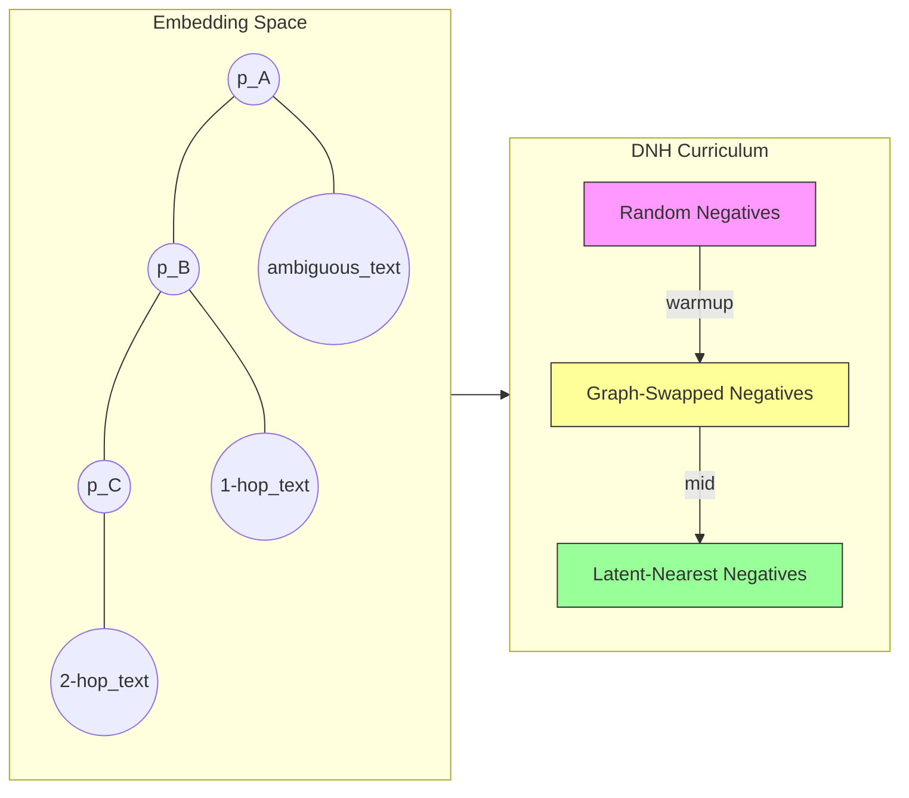

# KG-CAE: Model Design & Novel Research Ideas

This document focuses on the novel research ideas, conceptual design choices, theoretical motivations, and experimental designs for studying the KG-CAE architecture. It intentionally avoids implementation-level details and centers on research hypotheses, novel formulations, interpretability, failure modes, and the broader scientific contribution.

## 1. Conceptual Overview and Motivation

The central research goal of KG-CAE is to create representations that are both semantically rich and verifiably grounded in an external knowledge graph. The novelty lies in treating the semantic identifier as a verifiable entity (a canonical URI) and forcing the model's embedding geometry to reflect factual consistency.

Key motivations:
- Bridge the gap between continuous embedding spaces (useful for semantic search) and symbolic knowledge (verifiable URIs)
- Reduce hallucination by creating embeddings explicitly trained to respect knowledge graph constraints
- Improve negative sampling and contrastive learning by using hard negatives derived from structured graph edits (entity swapping)

## 2. High-Level Model Intuitions

1. Dual outputs serve complementary roles:
   - The classification output provides a discrete, verifiable symbol (URI) that can be used for exact lookup and downstream symbolic reasoning.
   - The embedding output provides a continuous space for graded similarity, retrieval, and downstream ranking.

2. Joint learning aligns the embedding geometry with symbolic classes:
   - By combining contrastive metric learning with the classification objective, we expect the embeddings for a given URI to cluster tightly while maintaining meaningful distances between different URIs based on factual closeness.

3. Hard negatives from knowledge graph operations are more informative than random negatives:
   - Swapping entities within the RDF context creates minimal lexical changes but large factual changes, forcing the model to learn factual signals rather than surface cues.

## 3. Novel Model Components and Research Questions

Below are the model design elements that are novel or warrant systematic study, followed by concrete research questions.

### 3.1. Knowledge-Aware Contrastive Regularizer (KACR)

Idea: augment the contrastive loss with a term that penalizes embeddings that contradict the knowledge graph's neighborhood structure.

- Formal intuition: If entity A is connected to entity B in the knowledge graph through ontology paths of length ≤ k, then embeddings of texts describing A and B should be relatively close in the embedding space compared to randomly related entities.

- Proposed form (research-level):
  L_kacr = E_{(A,B)~Adj_k} [ max(0, d(z_A, z_B) - τ_k) ]
  where Adj_k is the set of entity pairs within k-hops, d() is a distance metric, and τ_k is a learnable or calibrated margin per hop distance.

Research questions:
- How does adding KACR affect clustering of embeddings across ontological neighborhoods?
- Does KACR improve cross-domain generalization, e.g., entities with sparse textual coverage?

### 3.2. URI-Conditioned Latent Reshaping (UCLR)

Idea: use the predicted URI distribution as a soft-conditioning signal to reshape latent vectors before contrastive comparisons.

- Mechanism (conceptual): compute a soft-projection of embedding z onto a subspace spanned by prototype vectors corresponding to top-k predicted URIs. The projection adjusts z to emphasize components aligned with high-confidence URI candidates before computing triplet distances.

Research questions:
- Does URI-conditioning improve robustness to paraphrase and negation?
- How sensitive is UCLR to mis-calibrated URI probabilities?

### 3.3. Dynamic Negative Hardening (DNH)

Idea: dynamically adjust negative sampling difficulty during training using a curriculum that moves from easy to hard negatives, where hard negatives are mined from the quantized latent space or graph-based swaps.

- Curriculum schedule: begin with randomly sampled negatives, transition to graph-swapped negatives, then to latent-nearest but different-URI negatives.

Research questions:
- What is the optimal pacing for negative hardening for fastest convergence and best generalization?
- How do different negative sources (graph vs. latent) complement each other?

### 3.4. Multi-Hop Semantic Consistency Loss (MHSC)

Idea: impose consistency constraints across multi-hop traversals: if text T describes entity A, and A→B→C exists in the graph, then embeddings from texts that describe B and C should form a path-like geometry (monotonic distance increase along hops).

- Formal intuition: distances should roughly increase with hop length: d(z_A, z_B) < d(z_A, z_C) for 1-hop vs 2-hop.

Research questions:
- Can MHSC improve the model's ability to reason across indirect relationships?
- Does enforcing MHSC hurt fine-grained disambiguation when different 1-hop neighbors are semantically divergent?

## 4. Theoretical Framing and Expected Behaviors

In this section we recast the informal intuitions of KG-CAE into a formal, testable theoretical framing suitable for empirical study. We provide precise definitions, state explicit hypotheses, describe how to operationalize them, and propose evaluation metrics and statistical tests that allow accepting or rejecting each hypothesis.

### 4.1 Definitions and notation

- Let X denote the space of input strings (concatenated natural language + RDF context). Let G = (V, E) be the knowledge graph (e.g., DBpedia) where each node v ∈ V is associated with a canonical URI.
- The encoder f_θ : X → R^d maps input x ∈ X to a d-dimensional embedding z = f_θ(x). The classifier g_φ : R^d → Δ^{|V|} maps z to a probability distribution over subject URIs; denote the predicted URI as û(x) = argmax_u g_φ(f_θ(x))[u].
- Prototype (empirical): for entity u ∈ V we define the prototype p_u as the centroid of embeddings for texts whose canonical subject is u:

   p_u := E_{x: subject(x)=u}[ f_θ(x) ]

   In practice p_u is estimated from a held-out sample or via an exponential moving average (EMA) during training.

- Graph distance: h_G(u, v) denotes the shortest-path hop-count between u and v in G. We will use hop-based neighborhoods Adj_k(u) = { v : h_G(u,v) ≤ k }.

### 4.2 Core hypotheses (formalized)

- H1 (Geometry-as-Factuality): Embedding distance correlates with graph distance. Formally, for anchors x_u with subject u and any v ≠ u:

   E[ d( f_θ(x_u), p_v ) ] = Φ( h_G(u, v) )

   where Φ is monotonically non-decreasing in hop-length. Empirical test: estimate empirical means μ_h = E_{pairs at hop h}[ d ] and test monotonicity (Spearman ρ).

- H2 (Prototype Separability): Prototypes for distinct URIs are separated by a domain-calibrated margin τ_sep:

   d(p_u, p_v) > τ_sep  for most (u, v) pairs with u ≠ v.

   Operational test: compute the inter-prototype distance distribution and report the fraction below τ_sep compared to baselines.

- H3 (Calibration-Geometry Consistency): Classifier confidence for URI u correlates negatively with embedding distance to p_u:

   Corr( g_φ(f_θ(x))[u], -d(f_θ(x), p_u) ) > 0.

   Tests: Pearson/Spearman correlation, Brier score, and Expected Calibration Error (ECE).

- H4 (Prototype Tightness vs. Recall Trade-off): Increasing intra-class tightness (reducing Var_{x|u} ||f_θ(x)-p_u||^2) improves precision but can reduce recall on ambiguous mentions. Empirical test: sweep a regularizer coefficient and measure precision/recall curves.

### 4.3 Operationalization: what to measure and how

- Prototype estimation: estimate p_u using held-out examples or EMA during training (momentum α, e.g., 0.99). Report support size n_u (examples used to estimate p_u) for every prototype.
- Hop-based statistics: for anchors u in a stratified set U_a, compute μ_h = E_{v∈Adj_h(u)}[ d(p_u, p_v) ] for h=0..H. Plot μ_h vs h and compute Spearman ρ with associated p-value.
- Chain-wise monotonicity: for A→B→C chains, compute the fraction f_monotonic = P[ d(p_A,p_B) < d(p_A,p_C) ]. Report f_monotonic with standard error.

### 4.4 Metrics and statistical tests

- Embedding-factuality AUC: binary classification separating 1-hop neighbors from random non-neighbors using embedding distance; report ROC AUC.
- Prototype separation: mean and std of inter-prototype distances; fraction below τ_sep; compare distributions across models with a Kolmogorov–Smirnov test.
- Calibration: Brier score, ECE (10 bins), reliability diagrams; optionally perform temperature scaling as a baseline calibration method.
- Downstream metrics: entity linking accuracy, MRR, nDCG; perform paired bootstrap to test significance and correct multiple comparisons via Benjamini–Hochberg.

### 4.5 Theoretical mechanisms and expected effects of components

- KACR effect: the Knowledge-Aware Contrastive Regularizer pulls embeddings of k-hop neighbors closer (reducing μ_h for small h) and smooths prototype boundaries within ontological neighborhoods, improving retrieval for entities with sparse text.
- UCLR effect: URI-conditioned latent reshaping biases embeddings towards prototype subspaces of high-probability URIs, improving robustness to paraphrase but increasing sensitivity to miscalibrated probabilities.
- DNH effect: Dynamic Negative Hardening increases the model's sensitivity to factual corruption by exposing it progressively to harder negatives; expected effect is faster convergence to factual discrimination and improved embedding-factuality AUC.
- MHSC effect: Multi-Hop Semantic Consistency imposes radial ordering constraints (d(p_u, p_{h}) increasing with h) that should improve multi-hop retrieval accuracy at potential cost to 1-hop fine-grained disambiguation when neighbors are semantically divergent.

### 4.6 Empirical signatures of failure modes

- Over-clustering: low within-prototype variance combined with decreased recall for ambiguous mentions. Detection: distribution of within-class variances shifted left versus baseline; precision rises while recall falls.
- Surface-cue shortcuts: strong performance on random negatives but large degradation on graph-swap or paraphrase negatives. Detection: delta between random-negative accuracy and graph-swap negative accuracy.
- Calibration drift: increasing mismatch between classifier confidence and embedding proximity over training checkpoints. Detection: rising ECE/Brier scores or deteriorating reliability diagrams.

### 4.7 Experimental protocol to validate hypotheses

1. Prototype stability: compute p_u on held-out data and measure intra-class variance and prototype drift across checkpoints. Acceptance criterion: drift << inter-prototype separation.
2. Hop monotonicity: sample anchors U_a stratified by degree/domain, compute μ_h for h=0..3, test Spearman ρ (require ρ>0 with p<0.05 for acceptance under initial experiments).
3. KACR ablation: run full model vs. no-KACR; compare embedding-factuality AUC, MRR, and prototype separation. Use paired bootstrap for significance.
4. MHSC evaluation: measure 2-hop retrieval accuracy and 1-hop disambiguation metrics with and without MHSC; report trade-offs and plot distance-vs-hop curves.

### 4.8 Practical recommendations for training and tuning

- Prototype maintenance: maintain EMA prototypes (momentum 0.99) and recompute exact prototypes offline post-training for final evaluation.
- Loss balancing: tune λ_kacr and λ_mhsc on a small validation suite containing ambiguous mentions and multi-hop tasks.
- Regularizers: include an intra-class variance regularizer L_var = E_u[ Var_{x:subject=u} || f_θ(x) - p_u ||^2 ] with small coefficient (e.g., 1e-3) to avoid collapse while encouraging compactness.

### 4.9 Reporting standards and reproducibility

- Publish prototype support sizes, per-prototype example counts, and any filtering (min examples threshold) used when computing p_u.
- Release plots: distance-vs-hop, prototype-distance histograms, calibration plots, and DNH curriculum timelines.
- Provide code to recompute prototypes and reproduce the Spearman/chain monotonicity tests.

### 4.10 Limitations and open theoretical questions

- Sparse support: prototypes for low-resource entities are noisy; KACR helps by borrowing signal from neighbors but introduces bias.
- Domain heterogeneity: different ontology subgraphs exhibit different semantic radii; a single τ_sep may be inadequate — consider per-domain thresholds.
- Theoretical bounds: deriving formal generalization guarantees that connect graph topology to embedding geometry remains an open direction for future work.

### Figure captions (LaTeX-ready)

- Figure 1 (Prototype geometry): "Prototype geometry in KG-CAE. Each canonical URI u is associated with a prototype p_u in embedding space; embeddings for texts about u cluster around p_u. KACR pulls k-hop neighbors closer while MHSC imposes radial ordering across hop distances."

- Figure 2 (DNH curriculum): "Dynamic Negative Hardening curriculum. The x-axis shows training epochs; the stacked area chart shows the fraction of negative sources (random, graph-swap, latent-nearest) used per batch. A recommended schedule begins with random negatives, transitions to graph-swapped negatives, and finally mixes in latent-nearest negatives."

### Mermaid: prototype geometry + DNH curriculum

## 5. Interpretability and Explainability Research Directions

- Prototype Visualizations: map prototypical token sequences and RDF fragments that most strongly activate a URI's region.
- Attention and Attribution: use attention rollouts or token-level attributions to find which tokens or RDF triples drive URI predictions.
- Counterfactual Explanations: given a predicted URI, show minimal edits to RDF or text that flip the prediction (useful for debugging hallucinations).

## 6. Ablation and Analysis Study Designs (Research Focused)

A structured ablation plan to evaluate the contribution of each component:

- Baseline: contrastive-only, classification-only, and combined (full KG-CAE).
- KACR ablation: full model vs. model without KACR.
- UCLR ablation: full model vs. model without conditioning.
- DNH ablation: curriculum vs. static negative sampling.
- MHSC ablation: full model vs. model without MHSC.

Evaluation axes:
- Entity Linking Accuracy (standard benchmarks)
- Embedding Factuality (AUC-ROC on synthetic and real negative sets)
- Retrieval-based fact-checking (MRR, nDCG)
- Robustness to paraphrase, aliasing, and partial information

## 7. Anticipated Failure Modes and Mitigations

- Over-clustering: embeddings collapse into tight clusters that hurt recall. Mitigation: add intra-class variance regularizer or increase margin.
- Reliance on surface cues: model learns lexical shortcuts. Mitigation: adversarial paraphrase augmentation and MHSC.
- Calibration drift: classification probabilities misrepresent confidence. Mitigation: temperature scaling and calibration-based regularization.
- Knowledge graph noise: DBpedia contains errors or outdated facts. Mitigation: use multi-source corroboration (Wikidata, page revisions) and provenance scores.

## 8. Broader Research Agenda and Extensions

- Temporal and causal extensions: incorporate time-aware embeddings and causal graph structures
- Multimodal grounding: extend prototypes to include image and table modalities
- Interactive correction: human-in-the-loop mechanisms to update URI prototypes and correct mistakes

## 9. Publication and Dissemination Plan

- Target conferences: ACL/EMNLP for NLP contributions; NeurIPS/ICLR for representation learning contributions; ISWC/SemWeb for knowledge graph grounding applications.
- Release artifacts: dataset splits, prototypical examples, evaluation scripts, and interpretability visualizations.

---

I have created `Research_Model_Ideas.md`. Next steps: update `ResearchSummary.md` to point to this new document, then mark the todo completed. Let me know if you want a short executive summary or a figure to illustrate the novel components.